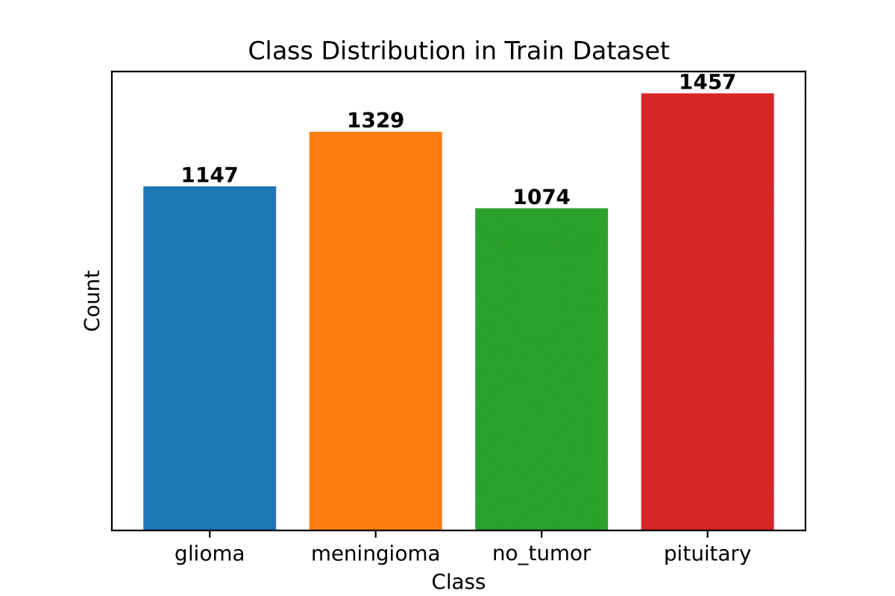
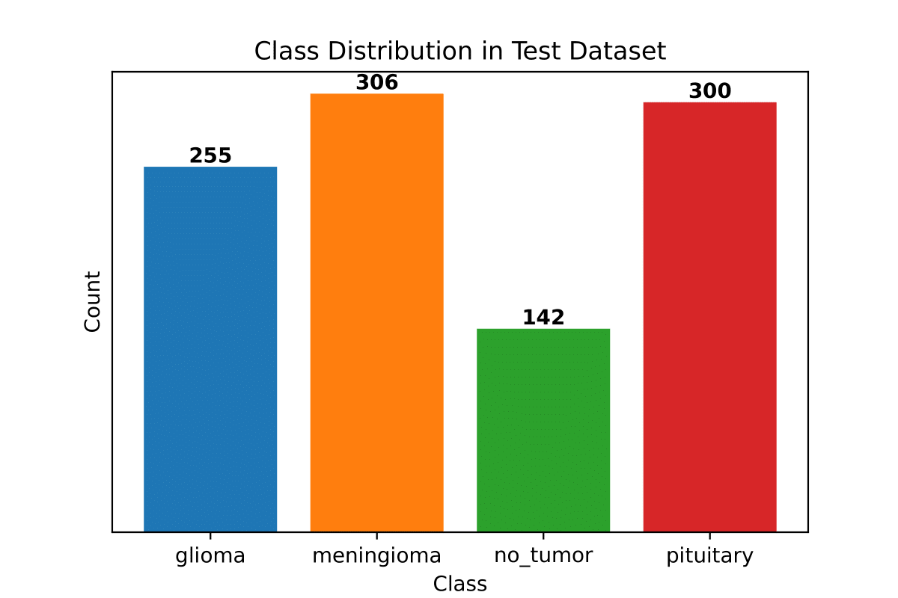
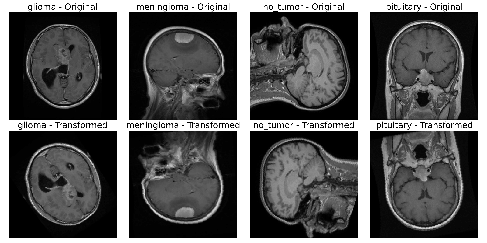
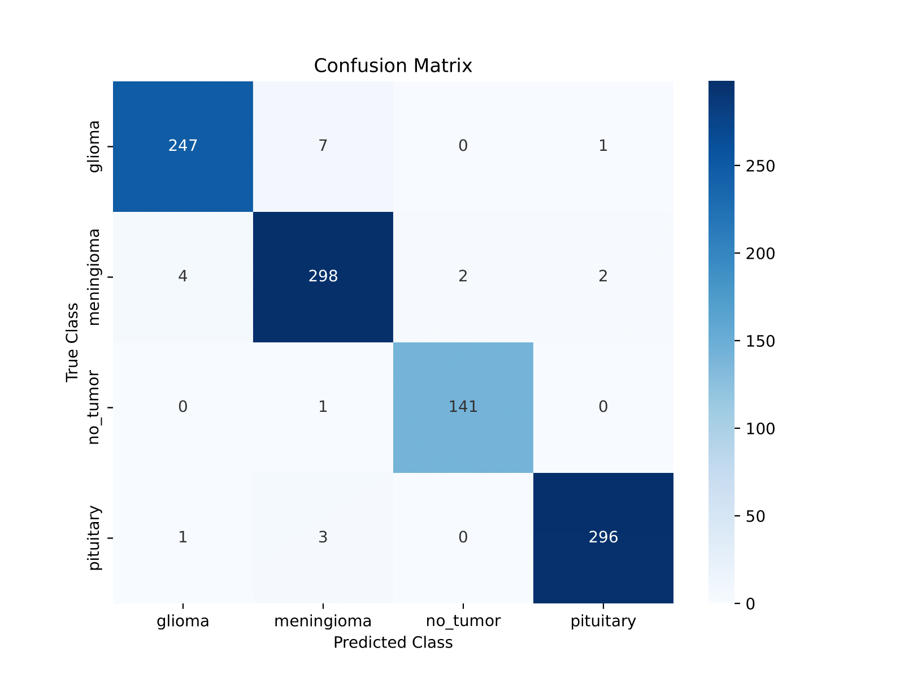
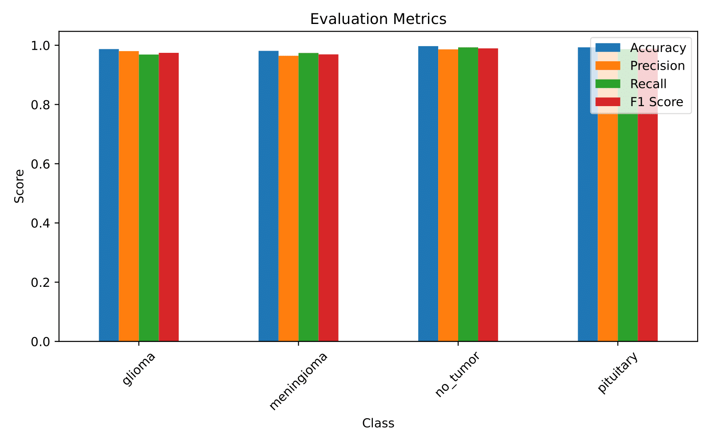
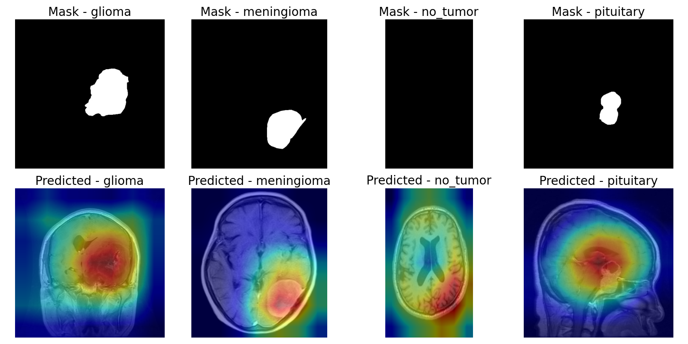
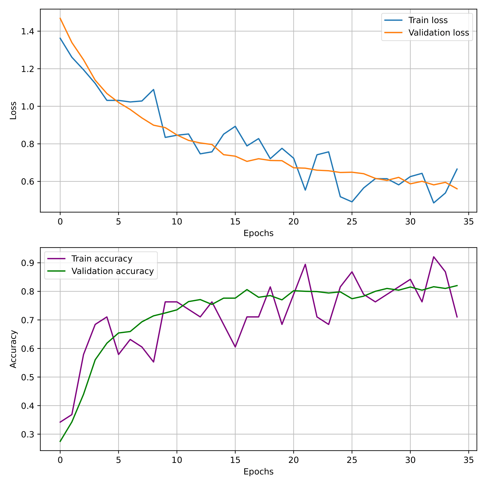
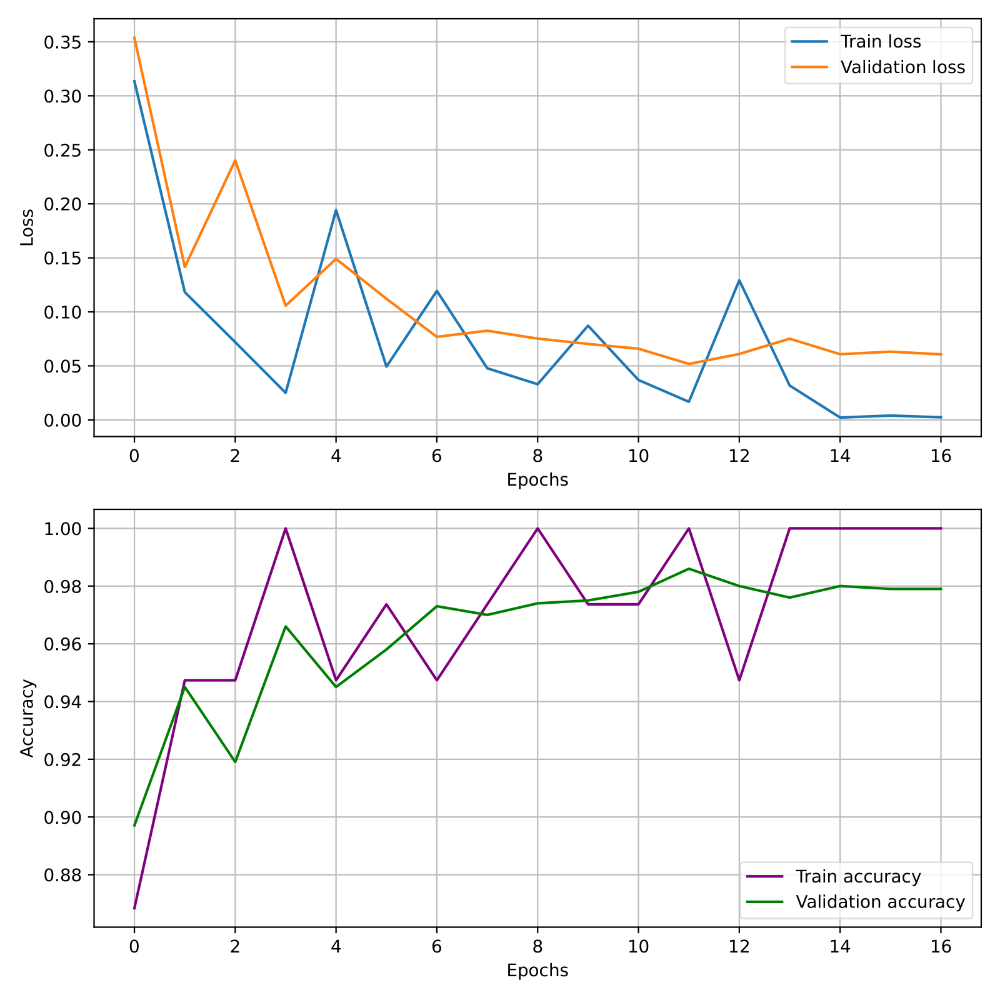

# Brain Tumor Classifier
This project addresses the problem of brain tumor classification from Magnetic Resonance Imaging (MRI) scans using deep learning techniques. The system is designed to provide accurate tumor detection from MRI data, highlighting the potential of deep learning in assisting medical diagnosis.

## Table of Contents
- [Brain Tumor Classifier](#brain-tumor-classifier)
- [Project's Goal](#projects-goal)
- [Dataset](#dataset)
- [Technologies and Tools](#technologies-and-tools)
- [Fine-Tuning Process](#fine-tuning-process)
- [Project structure](#project-structure)
- [How to download](#how-to-download)
- [Performance and Results](#performance-and-results)

## Project's Goal
The primary goal of this project is to create a simple and efficient pipeline capable of fine-tuning a pre-trained convolutional neural network to solve a multi-class classification task. This system is designed to distinguish between healthy and pathological brain scans by including a "no tumor" class. The project aims to achieve good performance in classifying three types of brain tumors.

## Dataset
The dataset used in this work consists of 6000 MRI scans ([Paper](https://arxiv.org/abs/2506.14318), [site](https://www.kaggle.com/datasets/briscdataset/brisc2025)). The images cover four classes: 
glioma, pituitary, meningioma, and no tumor. To ensure the trained model generalizes well, the images are taken from three different perspectives or planes: 
Coronal, Sagittal, and Axial.

<table>
  <tr>
    <td align="center">
      <br/>
    </td>
    <td align="center">
      <br/>
    </td>
  </tr>
</table>

Example of an images taken from each class and their transformed versions.


## Technologies and Tools
The project was developed in Python using the PyTorch library. For the classification task, a Deep Convolutional Neural Network called [ResNet18](https://arxiv.org/abs/1512.03385) was adopted as the backbone architecture due to its efficiency in image recognition. ResNet18 is a Residual Network with 18 layers and contains 11.2 million parameters.


Since the dataset is not large enough to train the entire model from scratch, a technique called fine-tuning was used.

# Fine-Tuning Process
The fine-tuning technique consists of the following main steps:

1. Copy the values of the pre-trained parameters into the model.

2. Rework the last one or two layers of the model, for example, by changing the number of output neurons to match the four classes being considered.

3. Freeze the values of all parameters except for the ones added in the previous step.

4. Train the new layers only.

5. Un-freeze the previous layers and fine-tune and continue training.

## Project structure

``` bash
Brain_Tumor_Classifier/
├── data/
│   └── … (datasets used for training-testing)
├── model/
│   └── … (model definitions, pretrained ResNet18 fine-tuned code)
├── utils/
│   └── … (utility functions, helpers for training, evaluation, data loading)
├── .gitignore            # to ignore temporary files
├── README.md             # main documentation of project
└── train_model_v1.ipynb  # notebook for training
```

## How to download

1. **Clone the repository**
   
    ```bash
    git clone https://github.com/Ultimi-Sumiti/Brain_Tumor_Classifier.git
    ```
2. **Navigate into the project directory**
   
    ```bash
    cd Brain_Tumor_Classifier
    ```
3. **Install dependencie**
   
    ```bash
     pip install -r requirements.txt
    ```
## Performance and Results
The experiments demonstrated strong classification performance with an accuracy that confirmed the model's reliability across different views. The results highlight the potential of deep learning frameworks in medical diagnosis. State-of-the-art applications of similar frameworks in computer vision have shown that their performance can be more reliable than that of many doctors from a statistical point of view.

Below are the results from the experiments.

<table>
  <tr>
    <td align="center">
      
    </td>
    <td align="center">
      
    </td>
  </tr>
</table>

<table align="center">
  <tr>
    <td align="center">
      
    </td>
  </tr>
</table>

<table>
  <tr>
    <td align="center">
      
       <sub>First training (all layers frozen except for the last one)</sub>
    </td>
    <td align="center">
      
       <sub>Fine tuning (no frozen layer)</sub>
    </td>
  </tr>
</table>
